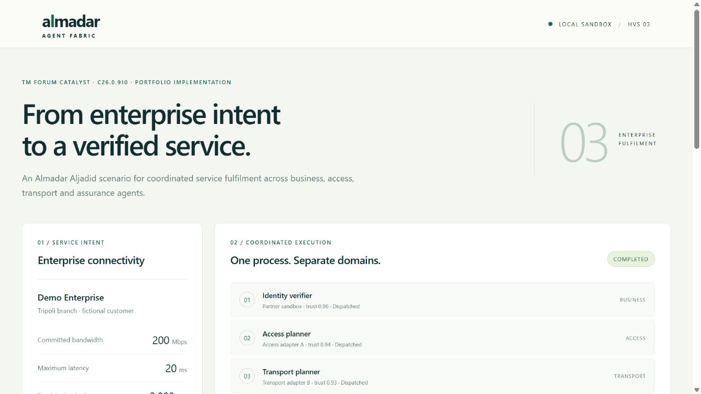
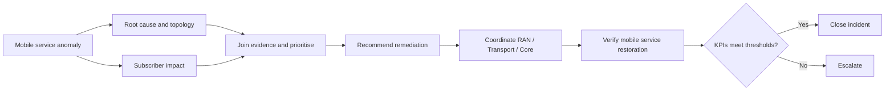

# Almadar Agent Fabric

**Mobile service assurance across RAN and transport — an Almadar Aljadid adaptation of HVS1.**

A portfolio reference implementation connected to my participation in [TM Forum Catalyst C26.0.910 — Agent Fabric: A2A-T Runtime, Phase III](https://www.tmforum.org/catalysts/projects/C26.0.910/agent-fabric-a2at-runtime-phase-iii). Almadar Aljadid participated as a champion mobile operator in a project bringing multiple operators and vendors together around telecom agent interoperability.

The use case starts with degraded mobile broadband across several cells sharing a transport path. Agents analyse the fault and subscriber impact, agree on a scoped recovery action, coordinate network domains, and verify service measurements before closing the incident. The process follows the supplied **HVS1 cross-domain service fault management BPMN**, adapted to a synthetic Almadar mobile network.



## Run it

Python 3.11 or later. No external services or API keys.

```sh
git clone https://github.com/MAbuain17/almadar-agent-fabric.git
cd almadar-agent-fabric
python -m almadar_fabric serve
```

Open **http://127.0.0.1:8080**, choose an operating condition and run assurance. Inspect agent handoffs, structured tasks, trust checks, explanations and governance observations. Export a run as JSON.

```sh
python -m almadar_fabric compile --output outputs/process.json
python -m almadar_fabric demo --output outputs/mobile.json
python -m almadar_fabric demo --scenario prompt-tampered
python -m almadar_fabric demo --scenario persistent-degradation
python -m almadar_fabric verify outputs/mobile.json
python -m unittest discover -s tests -v
```

Use `--incident path/to/incident.json` to supply an incident. The default represents 840 affected subscribers, three cells and a shared backhaul interface. Cell IDs, subscriber counts, measurements, location and recovery action are invented demo inputs, not Almadar operational data.

## Operator process



The local fault fixture is optical degradation on a shared backhaul interface. The transport adapter simulates a reroute; RAN and core adapters check their domains without changing configuration. Closure requires throughput and packet loss to meet the incident thresholds.

## How this relates to the Catalyst

The project distinguishes the **A2A-T semantic protocol**, the **OpenAN runtime**, and the **Agent Fabric trust and governance services**. This repository makes those responsibilities inspectable in a small local implementation:

| Project responsibility | Local implementation |
| --- | --- |
| Operator BPMN and knowledge context | Compile six activities, lane playbooks, graph edges and predecessor requirements |
| Task-T prompt registry | Six structured prompt sections, version and template hash |
| Capability discovery | Onboarded agent cards and skill aliases |
| Trusted Data Gateway / trust layer | Incident scope checks, privacy redaction, platform signing and receiver verification |
| Agent collaboration | Parallel analysis, evidence join and successive agent-owned handoffs |
| Negotiation-T and Event-T | Local domain subscription and scoped feasibility decision records |
| Governance, audit and explainability | Advisory score observations, hash-linked records and evidence references |

Reference roles from the supplied HVS vendor matrix include RADCOM for anomaly/CX inputs, Amdocs for analysis and problem resolution, Huawei for RAN and Infosys for IP/transport. Every adapter here is original simulated code. The wider project also includes MEF.DEV process translation, Iquall evaluation and OpenAN fabric services; their production implementations are not bundled here.

## Conditions to explore

| Condition | Expected outcome |
| --- | --- |
| Shared backhaul degradation | Transport action, verified restoration |
| Missing topology evidence | Operator escalation before any change |
| Bulk reset requested | Gateway blocks unsafe scope |
| Signed request altered | Receiver rejects the dispatch |
| Subscriber identifiers included | TDG redacts identifiers; aggregate impact retained |
| Service remains degraded | Recovery attempt recorded, incident stays open |
| Transport agent not onboarded | No domain action executes |

## Scope

This is a runnable **reference adaptation**, not an Almadar deployment or a reproduction of the official multi-vendor demonstration. It has no live OSS access, vendor SDK integration, LLM calls or standards conformance certification. The JSON-RPC-shaped messages use a documented local metadata profile; the project’s A2A-T SDK is not installed. The process graph is an in-memory subset rather than a full knowledge graph, and HMAC illustrates the attestation boundary rather than implementing the project’s JWS/PKI trust profile. Audit verification detects edited records in an exported chain; it does not provide external anchoring or durable production logging.

The source documents contain different governance proposals. This implementation follows the advisory trust-score variant and keeps payload enforcement separate from those scores. Synthetic measurements are not Catalyst benefit claims.

See [architecture](docs/architecture.md), [source mapping](docs/source-map.md), [project context](docs/project-context.md) and the [operator playbook](playbooks/mobile-assurance.md). Meeting minutes, standalone vendor documents and the team workspace are not published.

Original repository code is available under the MIT license. Project and vendor names identify reference roles; their software and source materials retain their own ownership and licenses.
