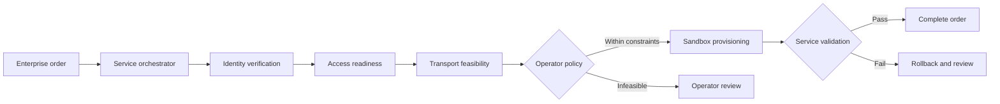

# Almadar Agent Fabric

**Enterprise service fulfilment across business, access, transport and assurance agents.**

A portfolio implementation developed from my participation in [TM Forum Catalyst C26.0.910 — Agent Fabric: A2A-T Runtime, Phase III](https://www.tmforum.org/catalysts/projects/C26.0.910/agent-fabric-a2at-runtime-phase-iii). The Catalyst brought operators and vendors together around telecom agent interoperability, governance and operational accountability. Almadar Aljadid participated as a champion operator.

This repository explores the enterprise fulfilment scenario for Almadar: take a connectivity order, find the right agents, check whether the service can be delivered, provision it, and validate the result. It is a small, runnable reference implementation with synthetic data and simulated domain adapters. It is separate from the official Catalyst runtime and vendor implementations.


## Run it

Python 3.11 or later. No API keys, paid services or runtime dependencies.

```sh
git clone https://github.com/MAbuain17/almadar-agent-fabric.git
cd almadar-agent-fabric
python -m almadar_fabric serve
```

Open **http://127.0.0.1:8080**. Choose an operating condition, run fulfilment, and expand any decision to inspect its task contract or evidence. Export a run as JSON to review the full trace.

For the command-line walkthrough:

```sh
python -m almadar_fabric demo --output outputs/ready.json
python -m almadar_fabric demo --scenario capacity-shortfall
python -m almadar_fabric demo --scenario validation-failed
python -m almadar_fabric verify outputs/ready.json
python -m unittest discover -s tests -v
```

An order can also be supplied with `--order almadar_fabric/data/enterprise-order.json`. The quoted costs and network measurements are fictional. LYD is used to make the commercial constraint concrete, not to represent an Almadar tariff.

## The use case

A fictional enterprise requests a 200 Mbps connection to a Tripoli branch, with latency at or below 20 ms and a provisioning budget of 2,000 LYD. The fabric coordinates five agent roles through a shared task contract:



Identity and access readiness are prerequisites. A capacity shortfall produces a proposal for operator review; it never silently reduces the requested bandwidth. Budget and latency constraints are checked before provisioning. The order is completed only after throughput and latency tests pass.

| Operating condition | Outcome |
| --- | --- |
| Ready for activation | Service configured and validated |
| Access circuit needs construction | Survey/build plan requested; no provisioning |
| Transport capacity is insufficient | Alternative capacity proposal; operator decision required |
| Enterprise identity cannot be verified | Order rejected before network activity |
| Provisioner has insufficient trust | Dispatch blocked by agent discovery policy |
| Activation latency exceeds the SLA | Sandbox configuration rolled back |

## What is implemented

- Capability-based discovery using agent cards, onboarding state and a trust threshold.
- Structured task handoffs with a shared context ID, explicit intent and operator constraints.
- Feasibility negotiation and clear operator handoff conditions.
- Separate deterministic adapters for identity, access, transport, provisioning and assurance.
- Policy gates, post-activation checks and compensating rollback.
- Hash-linked decision records with evidence references and a JSON export.
- A local browser walkthrough, command-line runner and automated checks.

The Task-T, Event-T and Negotiation-T concepts inform the local contracts. These contracts are **illustrative**: this project does not implement A2A wire transport, use the OpenAN SDK, or claim conformance to IG1453. Agents run in one process; adapter labels represent domain boundaries rather than connections to actual vendors. Trust scores are fixed fixtures. Audit hashes help detect edits against a retained head hash; they are not signatures or immutable storage.

## Project guide

| Path | Purpose |
| --- | --- |
| [`almadar_fabric/runtime.py`](almadar_fabric/runtime.py) | Fulfilment process and policy decisions |
| [`almadar_fabric/agents.py`](almadar_fabric/agents.py) | Registry and simulated domain adapters |
| [`almadar_fabric/models.py`](almadar_fabric/models.py) | Order, agent card and task contracts |
| [`almadar_fabric/audit.py`](almadar_fabric/audit.py) | Audit chain creation and verification |
| [`almadar_fabric/web/`](almadar_fabric/web/) | Browser walkthrough |
| [`docs/architecture.md`](docs/architecture.md) | Design decisions and integration boundaries |
| [`playbooks/enterprise-fulfilment.md`](playbooks/enterprise-fulfilment.md) | Almadar operator process |
| [`docs/project-context.md`](docs/project-context.md) | Catalyst context and source attribution |

## Relationship to OpenAN and A2A-T

[OpenAN](https://openan.dev/) provides the broader open runtime direction, including registration and orchestration components. Its [Python A2A-T SDK](https://github.com/project-openan/a2a-t-sdk-python) is the relevant integration starting point. The upstream [telecom extension proposal](https://github.com/a2aproject/A2A/issues/1796) describes task metadata, negotiation and event notification profiles.

The next engineering step would be to replace local dispatch with SDK-backed calls, register real domain agents, and connect the policy gates to operator-approved OSS adapters. The [architecture notes](docs/architecture.md) spell out those boundaries.

## Attribution and scope

The Catalyst's architecture and scenarios are collaborative work. This repository contains an independent Almadar scenario adaptation and original demonstration code. It does not attribute the shared runtime, protocol or other vendors' agents to me. Meeting minutes, internal working decks and standalone vendor documents are excluded. No measured production benefits or formal autonomy level are claimed for this demo.

MIT license applies to the original code and documentation in this repository. TM Forum, Almadar Aljadid and vendor names remain the property of their respective owners; mentioning them does not imply endorsement.
