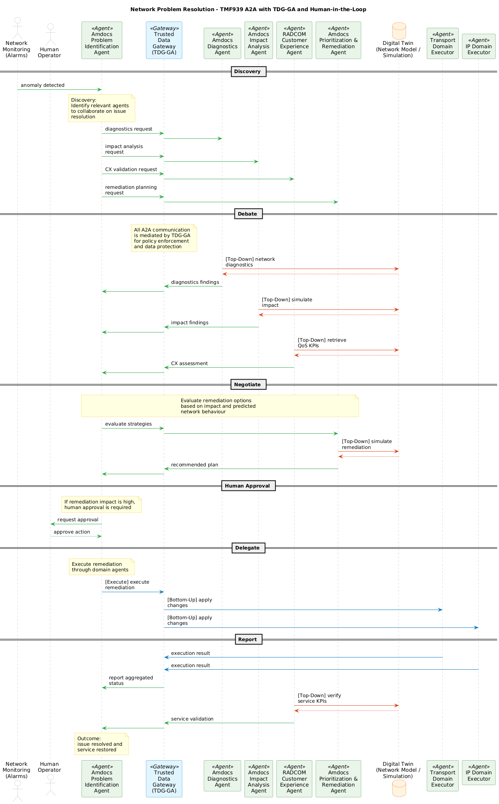

# Project reference library

Selected artifacts from Agent Fabric: A2A-T Runtime, Phase III (C26.0.910). These are supplied project materials, kept separately from the local Almadar mobile-assurance implementation.

## Presentations

| Artifact | Purpose |
| --- | --- |
| [Phase III overview — June 10](presentations/phase-iii-overview-june10.pptx) | Project architecture, fabric capabilities and HVS demonstrations |
| [Trust score calculation](presentations/trust-score-calculation.pptx) | Governance observations and the advisory score variant used in this demo |
| [TM Forum assets used and contributed](presentations/tm-forum-assets-used-and-contributed.pptx) | Standards references and collaborative contributions |
| [Cross-domain fault resolution — March 24](presentations/cross-domain-fault-resolution-march24.pptx) | Earlier fault-resolution proposal and multi-domain collaboration context |
| [Cover slide — archived](presentations/cover-slide-archive.pptx) | Project cover artwork retained as an archival presentation asset |

PowerPoint links open the original deck files for download. The March proposal and archived cover are historical context; the later overview and HVS1 process guide the runnable adaptation.

## Demonstration

[Watch or download the design-time evaluation demo](demos/design-time-evaluation.mp4).

This supplied recording demonstrates the project's evaluation work. It is separate from this repository's local assurance walkthrough.

## Architecture

[Open the full sequence diagram](architecture/tmf939-a2a-sequence.png). The diagram shows discovery, debate, negotiation, human approval, domain execution and reporting. It describes the shared project design; the local implementation covers a smaller simulated process.

## Identity assets

Almadar Aljadid is the mobile operator represented by this adaptation. The supplied Huawei mark is retained as a [partner identity asset](../assets/partners/huawei.png); vendor reference roles are described in the main README. The two identical Huawei attachments are represented by one asset.

## Attribution

The decks, recording, sequence diagram and logos retain their original ownership and any applicable source terms. The repository's MIT license applies to its original code and documentation, not third-party presentations, media or trademarks. Inclusion does not imply that this local demo implements every component shown in those artifacts.
